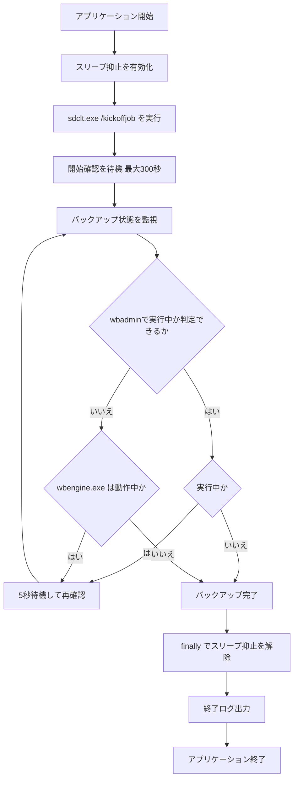

# 設計書

## 概要

### 背景・目的

背景：長時間の Windows バックアップ中に PC が自動スリープへ移行すると、
バックアップ処理が中断または失敗する可能性がある。

目的：バックアップ開始前に自動スリープを抑止し、完了後に確実に元へ戻すことで、
無人実行時でも安全かつ確実にバックアップを完了させる。

### 機能一覧

- バックアップ開始直前に Win32 API を用いてシステムスリープを一時抑止する。
- Windows 標準バックアップコマンド `sdclt.exe /kickoffjob` を実行する。
- バックアップ状態は `wbadmin get status` を優先して定期監視し、利用不可時は `wbengine.exe` の稼働監視へフォールバックして完了まで待機する。
- 正常終了・異常終了を問わず、終了時にスリープ抑止状態を解除して通常状態へ復元する。

## 入力

### 実行入力（コマンド）

| 項目 | 内容 |
| ---- | ---- |
| 実行ファイル | `BackupSleepSuppressor.ps1` |
| 実行方法 | PowerShell から直接実行、またはタスクスケジューラー起動 |
| 必須引数 | なし |
| 対話入力 | なし（無人実行前提） |

### システム入力（監視対象）

| 項目 | 内容 |
| ---- | ---- |
| バックアップ起動コマンド | `sdclt.exe /kickoffjob` |
| 監視方式 | `wbadmin get status`（優先） / `wbengine.exe` 監視（フォールバック） |
| 監視間隔 | 5 秒（既定） |
| 判定条件 | `wbadmin get status` が「実行中でない」状態、またはフォールバック時に `wbengine.exe` が存在しない状態で完了 |

## 出力

### ログファイル

- 「ログ出力」の章に記載する。

### 処理結果

| 項目 | 内容 |
| ---- | ---- |
| 主結果 | Windows バックアップの開始および完了待機 |
| 副結果 | スリープ抑止の開始と解除 |
| 終了コード | 0: 正常終了 / 1: 異常終了 |

## 実行方法

```powershell
.\BackupSleepSuppressor.ps1
```

タスクスケジューラー登録時は「最上位の特権で実行する」を有効化する。

## 想定実行環境

| 項目 | 内容 |
| ---- | ---- |
| OS | Windows 10 / Windows 11 |
| 実行権限 | 管理者権限（Administrator） |
| PowerShell | 5.1（固定） |
| .NET / Win32 API | P/Invoke が利用可能であること |

## 制限事項

- 監視は既定 5 秒間隔のポーリングで行うため、監視間隔内に開始と終了が完了する短時間ジョブは開始検知できない可能性がある。
- 本スクリプトは、長時間バックアップの完了待機を主目的とする。
- `wbadmin get status` の判定は日本語出力（例: 「実行中」「実行中の操作はありません」）および英語出力（例: "In progress", "No operation in progress"）に対応する。その他ロケールは Unknown 扱いとなり、必要に応じて `wbengine.exe` 監視へフォールバックする。

## 処理詳細

1. アプリケーション開始ログを出力する。
1. `SetThreadExecutionState` を呼び出し、スリープ抑止を有効化する。
1. `sdclt.exe /kickoffjob` を実行してバックアップを開始する。
1. 最大 300 秒以内にバックアップ開始を確認し、開始確認後に監視ループへ入る。
1. 一定間隔で `wbadmin get status` を優先して確認し、利用不可時は `wbengine.exe` の存在確認へフォールバックする。
1. バックアップが実行中でないことを検知したら完了ログを出力する。
1. `finally` ブロックで `SetThreadExecutionState` を解除し、通常の省電力設定へ戻す。
1. アプリケーション終了ログを出力して終了する。



## ログ出力

### ログ出力概要

| 項目 | 内容 |
| ---- | ---- |
| 出力先 | logs/app_yyyyMMdd.log |
| ログレベル | INFO / WARN / ERROR |
| フォーマット | `yyyy-MM-dd HH:mm:ss [LEVEL] message` |

### ログ出力例

```text
2026-07-31 01:00:00 [INFO] アプリケーションを開始しました
2026-07-31 01:00:00 [INFO] スリープ抑止を有効化しました
2026-07-31 01:00:01 [INFO] バックアップを開始しました: sdclt.exe /kickoffjob
2026-07-31 01:00:06 [INFO] バックアップ監視中: バックアップ処理 実行中
2026-07-31 01:12:41 [INFO] バックアップ完了を検知しました
2026-07-31 01:12:41 [INFO] スリープ抑止を解除しました
2026-07-31 01:12:41 [INFO] アプリケーションを終了します
```

### ログメッセージ

| No. | レベル | テンプレート |
| ---- | ---- | ---- |
| 1 | INFO | アプリケーションを開始しました |
| 2 | INFO | スリープ抑止を有効化しました |
| 3 | INFO | バックアップを開始しました: `{command}` |
| 4 | INFO | バックアップ監視中: バックアップ処理 実行中 |
| 5 | INFO | バックアップ完了を検知しました |
| 6 | ERROR | バックアップ開始に失敗しました: `{error_message}` |
| 7 | ERROR | 監視中にエラーが発生しました: `{error_message}` |
| 8 | WARN | スリープ抑止解除処理で警告が発生しました: `{warning_message}` |
| 9 | INFO | スリープ抑止を解除しました |
| 10 | INFO | アプリケーションを終了します |

## ライセンス

### 本プログラムのライセンス

- このプログラムは MIT ライセンスに基づいて提供される。

### 使用コンポーネントのライセンス

| コンポーネント | 種別 | ライセンス |
| ---- | ---- | ---- |
| Windows Backup (`sdclt.exe`, `wbengine.exe`) | OS 標準機能 | Microsoft Windows 使用許諾に準拠 |
| .NET Framework / Win32 API | OS 標準機能 | Microsoft Windows 使用許諾に準拠 |

## 開発詳細

### 開発環境

- VSCode 1.130.0
- Windows PowerShell 5.1

### 検証環境

| 項目 | 内容 |
| ---- | ---- |
| CPU | Intel64 Family 6 Model 198 Stepping 2 GenuineIntel ~2400 Mhz |
| メモリー | 16 GB |
| OS | Windows 11 |
| PowerShell | 5.1 |
| 実行権限 | 管理者権限 |
