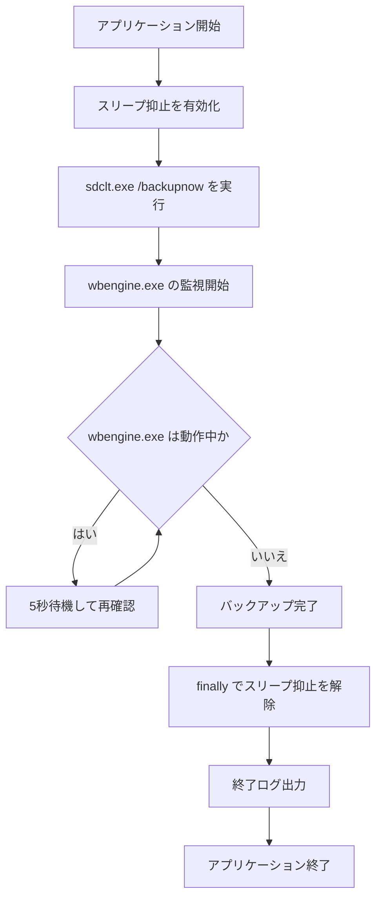

# 設計書

## 概要

### 背景・目的

背景：長時間の Windows バックアップ中に PC が自動スリープへ移行すると、
バックアップ処理が中断または失敗する可能性がある。

目的：バックアップ開始前に自動スリープを抑止し、完了後に確実に元へ戻すことで、
無人実行時でも安全かつ確実にバックアップを完了させる。

### 機能一覧

- バックアップ開始直前に Win32 API を用いてシステムスリープを一時抑止する。
- Windows 標準バックアップコマンド `sdclt.exe /backupnow` を実行する。
- バックアップ中は `wbengine.exe` の稼働状態を定期監視し、完了まで待機する。
- 正常終了・異常終了を問わず、終了時にスリープ抑止状態を解除して通常状態へ復元する。

## 入力

### 実行入力（コマンド）

| 項目 | 内容 |
| ---- | ---- |
| 実行ファイル | `BackupSleepSuppressor.ps1` |
| 実行方法 | PowerShell から直接実行、またはタスクスケジューラー起動 |
| 必須引数 | なし |
| 対話入力 | なし（無人実行前提） |

### システム入力（監視対象）

| 項目 | 内容 |
| ---- | ---- |
| バックアップ起動コマンド | `sdclt.exe /backupnow` |
| 監視対象プロセス | `wbengine.exe` |
| 監視間隔 | 5 秒（既定） |
| 判定条件 | `wbengine.exe` が存在しなくなった時点で完了 |

## 出力

### ログファイル

- 「ログ出力」の章に記載する。

### 処理結果

| 項目 | 内容 |
| ---- | ---- |
| 主結果 | Windows バックアップの開始および完了待機 |
| 副結果 | スリープ抑止の開始と解除 |
| 終了コード | 0: 正常終了 / 1: 異常終了 |

## 実行方法

```powershell
.\BackupSleepSuppressor.ps1
```

タスクスケジューラー登録時は「最上位の特権で実行する」を有効化する。

## 想定実行環境

| 項目 | 内容 |
| ---- | ---- |
| OS | Windows 10 / Windows 11 |
| 実行権限 | 管理者権限（Administrator） |
| PowerShell | 3.0 以上 |
| .NET / Win32 API | P/Invoke が利用可能であること |

## 処理詳細

1. アプリケーション開始ログを出力する。
1. `SetThreadExecutionState` を呼び出し、スリープ抑止を有効化する。
1. `sdclt.exe /backupnow` を実行してバックアップを開始する。
1. `wbengine.exe` が起動していることを確認し、監視ループへ入る。
1. 一定間隔で `wbengine.exe` の存在を確認し、存在する間は待機する。
1. `wbengine.exe` の終了を検知したら完了ログを出力する。
1. `finally` ブロックで `SetThreadExecutionState` を解除し、通常の省電力設定へ戻す。
1. アプリケーション終了ログを出力して終了する。



## ログ出力

### ログ出力概要

| 項目 | 内容 |
| ---- | ---- |
| 出力先 | logs/app_yyyyMMdd.log |
| ログレベル | INFO / WARN / ERROR |
| フォーマット | `yyyy-MM-dd HH:mm:ss [LEVEL] message` |

### ログ出力例

```text
2026-07-31 01:00:00 [INFO] アプリケーションを開始しました
2026-07-31 01:00:00 [INFO] スリープ抑止を有効化しました
2026-07-31 01:00:01 [INFO] バックアップを開始しました: sdclt.exe /backupnow
2026-07-31 01:00:06 [INFO] バックアップ監視中: wbengine.exe 実行中
2026-07-31 01:12:41 [INFO] バックアップ完了を検知しました
2026-07-31 01:12:41 [INFO] スリープ抑止を解除しました
2026-07-31 01:12:41 [INFO] アプリケーションを終了します
```

### ログメッセージ

| No. | レベル | テンプレート |
| ---- | ---- | ---- |
| 1 | INFO | アプリケーションを開始しました |
| 2 | INFO | スリープ抑止を有効化しました |
| 3 | INFO | バックアップを開始しました: `{command}` |
| 4 | INFO | バックアップ監視中: `{process_name}` 実行中 |
| 5 | INFO | バックアップ完了を検知しました |
| 6 | ERROR | バックアップ開始に失敗しました: `{error_message}` |
| 7 | ERROR | 監視中にエラーが発生しました: `{error_message}` |
| 8 | WARN | スリープ抑止解除処理で警告が発生しました: `{warning_message}` |
| 9 | INFO | スリープ抑止を解除しました |
| 10 | INFO | アプリケーションを終了します |

## ライセンス

### 本プログラムのライセンス

- このプログラムは MIT ライセンスに基づいて提供される。

### 使用コンポーネントのライセンス

| コンポーネント | 種別 | ライセンス |
| ---- | ---- | ---- |
| Windows Backup (`sdclt.exe`, `wbengine.exe`) | OS 標準機能 | Microsoft Windows 使用許諾に準拠 |
| .NET Framework / Win32 API | OS 標準機能 | Microsoft Windows 使用許諾に準拠 |

## 開発詳細

### 開発環境

- VSCode 1.100.3
- Windows PowerShell 5.1

### 検証環境

| 項目 | 内容 |
| ---- | ---- |
| CPU | Intel64 Family 6 Model 154 Stepping 3 |
| メモリー | 16 GB |
| OS | Windows 11 |
| PowerShell | 5.1 |
| 実行権限 | 管理者権限 |
